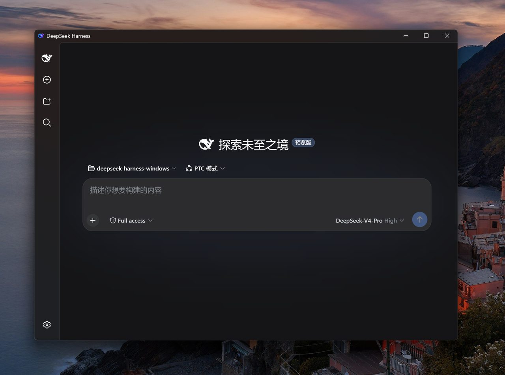

# deepseek-harness-windows

English | [中文](README.zh.md)

Windows desktop packaging for DeepSeek Harness



## Features

- Windows installers built via CI/CD, for easy startup and consistent install/uninstall
- Closing the window minimizes to the tray; launch at login can be enabled.
- Pops a native Windows notification when a task completes
- Mica shell, plus a few detail tweaks for a more immersive feel

## Command line and plugins

The installer offers an optional **"Add dsh command-line tool to PATH"** component. It writes a launcher to `<install dir>\bin\dsh.cmd` — `%LOCALAPPDATA%\DeepSeek Harness` for a per-user install, `%ProgramFiles%\DeepSeek Harness` for a machine-wide one — and adds that `bin` directory to PATH, so `dsh` works in any terminal:

```powershell
dsh --help
dsh plugin --profile web list
```

The launcher uses the runtime bundled with the app — you do not need Node or npm installed.

### Installing plugins

`dsh plugin` shells out to **pnpm**, so the runtime ships its own copy and `dsh.cmd` puts it on PATH for that child process only. Plugins therefore install on a clean machine with no global Node, npm, or pnpm:

```powershell
dsh plugin --profile web add dsh-plugin-smooth-stream
```

Restart DeepSeek Harness afterwards — host-side plugin code loads with the server. Installing from a GitHub repository works too:

```powershell
dsh plugin --profile web add github:SpookySandwich/dsh-plugin-rollout-scout
```

The installer can also pre-install [dsh-plugin-smooth-stream](https://github.com/SpookySandwich/dsh-plugin-smooth-stream) as an optional component; the shell merges it into the web profile on first run.

### A note on the PATH entry

Editing PATH from an installer is easy to get catastrophically wrong, so this one does not do it directly.

NSIS strings are capped at `NSIS_MAX_STRLEN` (1024 characters). A PATH longer than that comes back from `ReadRegStr` **truncated or empty**, and the usual read-append-write approach then writes that truncated value back — destroying the user's PATH. This is a well-known NSIS footgun and it is why an earlier build of this installer wiped PATH for users who enabled the option.

What ships instead:

- PATH is read and written by a **PowerShell helper**, not by NSIS, so no length cap applies.
- The value is read with `DoNotExpandEnvironmentNames` and written back as `ExpandString`, so entries like `%SystemRoot%\system32` stay unexpanded rather than being frozen into literal paths.
- If the helper fails for any reason, PATH is **left untouched** — `dsh.cmd` still works via its full path.
- The append is idempotent, and the `DshPathAdded` marker is only recorded on success.
- Uninstall removes **only the exact entry** that was added, and only if the marker says this installer added it.

Per-user installs edit the user PATH (`HKCU\Environment`); machine-wide installs edit the system PATH.

If you skip the component, the launcher is not created; you can still run the app normally, or add the `bin` directory to PATH yourself.

## Architecture

```text
Tauri 2 shell (Rust)                        sidecar (node.exe + node_modules)
  window: Mica + injected CSS                 node .../dsh/lib/bin.js web
  tray / notifications / autostart            -> http://127.0.0.1:<free port>
  spawn sidecar -------------------------->   WebView2 loads that local port
```

## Layout

- `shell/` — Tauri 2 shell (Rust logic + splash page).
- `scripts/prepare-runtime.ps1` — builds the sidecar runtime (installs dsh + copies node.exe / node_modules).
- `.github/workflows/release.yml` — CI: fetch → prepare runtime → build → release.
- `docs/SAFETY.md` — safety rules for self-hosted environments (port/process isolation).

## Development

Prerequisites: Rust (MSVC toolchain), Node 22+.

```powershell
# 1. Prepare the dev sidecar runtime
npm install @deepseek-ai/dsh@latest --prefix sidecar --omit=dev --no-audit --no-fund

# 2. Install shell deps and run
cd shell
npm install
$env:DSH_RUNTIME_DIR = "D:/deepseek-harness-windows/sidecar"
npm run tauri dev
```

## Packaging

```powershell
./scripts/prepare-runtime.ps1   # produces shell/src-tauri/resources/runtime
cd shell
npm install
npm run tauri build             # NSIS installer in src-tauri/target/release/bundle/nsis/
```
